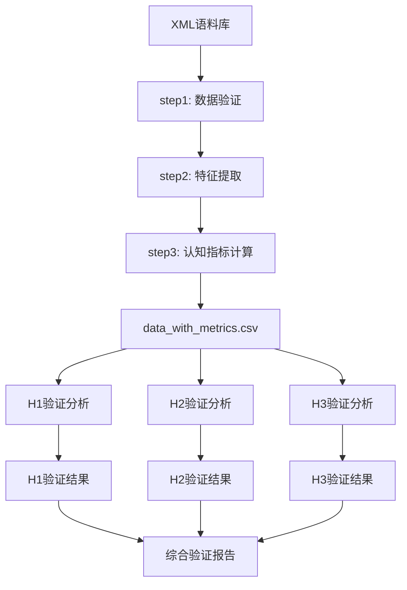
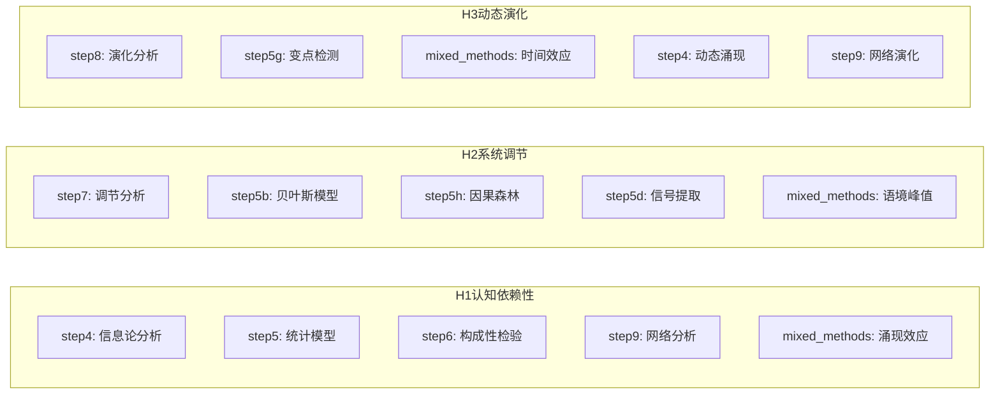

# H1-H3验证分析脚本编制指南

## 一、概述

本指南旨在指导如何将现有的多个分析脚本整合为三个假设验证脚本（H1验证分析.py、H2验证分析.py、H3验证分析.py），每个脚本将整合相关分析方法，生成综合性的验证报告。

## 二、整体架构设计

### 2.1 脚本结构模式

```python
class H[X]HypothesisValidator:
    """假设H[X]的综合验证器"""
    
    def __init__(self, data_path='../output_cn/data'):
        self.data_path = Path(data_path)
        self.results = {
            'hypothesis': 'H[X]',
            'support_level': 0,
            'evidence': {},
            'visualizations': {},
            'timestamp': datetime.now().isoformat()
        }
        
    def load_data(self):
        """加载所有必要的数据文件"""
        
    def run_all_analyses(self):
        """运行所有相关分析"""
        
    def integrate_evidence(self):
        """整合所有证据，计算综合支持度"""
        
    def generate_visualization(self):
        """生成综合可视化图表（单个图片，多个子图）"""
        
    def generate_report(self):
        """生成Markdown格式的综合报告"""
        
    def save_results(self):
        """保存所有结果（CSV、JSON、JPG、MD）"""
```

### 2.2 数据流程图



### 2.3 假设验证依赖关系



## 三、具体实现规范

### 3.1 H1验证分析脚本规范

#### 必须包含的分析模块：
1. **信息论分析**（来自step4）
   - 功能互补性指标
   - 三重交互互信息
   - 条件互信息

2. **构成性检验**（来自step6）
   - 虚拟移除测试
   - 路径必要性分析
   - 系统鲁棒性评估

3. **统计模型**（来自step5）
   - M1线性基准模型
   - M3非线性模型
   - M4 VAR因果分析

4. **网络分析**（来自step9）
   - DSR中介中心性
   - 认知网络密度

5. **混合方法**（来自mixed_methods）
   - 认知涌现效应
   - DSR×TL协同作用

#### 输出要求：
- **数据文件**：
  - `H1_validation_results.csv`：所有指标的表格数据
  - `H1_validation_results.json`：详细的分析结果
- **可视化**：
  - `H1_cognitive_dependency_analysis.jpg`：包含5个子图的综合图表
- **报告**：
  - `H1_validation_report.md`：完整的验证报告

### 3.2 H2验证分析脚本规范

#### 必须包含的分析模块：
1. **调节效应分析**（来自step7）
   - 语境调节强度
   - 简单斜率分析
   - 交互效应可视化

2. **贝叶斯分层模型**（来自step5b）
   - R²随语境变化
   - 后验分布分析

3. **异质性效应**（来自step5h）
   - 因果森林分析
   - 敏感度子群识别

4. **功能模式分析**（来自functional_pattern）
   - 高敏感度语境模式

5. **混合方法**（来自mixed_methods）
   - 中等语境峰值效应
   - 非线性调节模式

#### 输出要求：
- **数据文件**：
  - `H2_validation_results.csv`
  - `H2_validation_results.json`
- **可视化**：
  - `H2_system_moderation_analysis.jpg`
- **报告**：
  - `H2_validation_report.md`

### 3.3 H3验证分析脚本规范

#### 必须包含的分析模块：
1. **动态演化分析**（来自step8）
   - S曲线拟合
   - 演化阶段识别
   - 成熟度评估

2. **变点检测**（来自step5g）
   - 贝叶斯变点分析
   - 结构突变识别

3. **混合方法**（来自mixed_methods）
   - 时间效应递增
   - 系统稳定性指标

4. **网络演化**（来自step9）
   - 季度网络密度变化
   - 中心性演化

5. **信号提取**（来自step5d）
   - 趋势分离
   - 周期性模式

#### 输出要求：
- **数据文件**：
  - `H3_validation_results.csv`
  - `H3_validation_results.json`
- **可视化**：
  - `H3_dynamic_evolution_analysis.jpg`
- **报告**：
  - `H3_validation_report.md`

## 四、代码复用策略

### 4.1 导入现有功能

```python
# 不要复制代码，而是导入现有功能
from step4_information_theory import InformationTheoryAnalyzer
from step5_statistical_models import StatisticalModeler
from step6_constitutiveness_tests import ConstitutivenessAnalyzer
# ... 其他导入

class H1CognitiveDependencyValidator:
    def __init__(self):
        # 初始化各个分析器
        self.info_analyzer = InformationTheoryAnalyzer()
        self.stat_modeler = StatisticalModeler()
        self.const_analyzer = ConstitutivenessAnalyzer()
```

### 4.2 数据加载统一化

```python
def load_base_data(self):
    """加载基础数据"""
    # 所有脚本使用相同的数据加载逻辑
    self.df = pd.read_csv(self.data_path / 'data_with_metrics.csv')
    self.df['date'] = pd.to_datetime(self.df['date'])
    
    # 加载各分析结果
    with open(self.data_path / 'information_theory_results.json', 'r') as f:
        self.info_results = json.load(f)
    # ... 加载其他结果
```

## 五、可视化规范

### 5.1 综合图表布局

```python
def create_comprehensive_figure(self):
    """创建综合可视化图表"""
    fig = plt.figure(figsize=(20, 16), dpi=1200)
    
    # H1示例：5个子图布局
    # 1. 信息论指标（左上）
    ax1 = plt.subplot(3, 2, 1)
    # 2. 构成性测试结果（右上）
    ax2 = plt.subplot(3, 2, 2)
    # 3. 统计模型对比（左中）
    ax3 = plt.subplot(3, 2, 3)
    # 4. 网络中心性（右中）
    ax4 = plt.subplot(3, 2, 4)
    # 5. 综合证据雷达图（底部跨列）
    ax5 = plt.subplot(3, 1, 3)
    
    plt.tight_layout()
    return fig
```

### 5.2 样式统一

- 使用一致的颜色方案
- 字体：Windows系统字体路径
- 分辨率：1200 DPI
- 文件格式：JPG
- 无标题（文件名即标题）

## 六、报告生成规范

### 6.1 Markdown报告结构

```markdown
# H[X]假设验证报告

## 执行摘要
- 假设内容
- 支持度评分
- 关键发现

## 详细分析结果

### [分析方法1]
- 指标值
- 统计显著性
- 可视化说明

### [分析方法2]
...

## 综合证据评估
- 证据强度矩阵
- 支持度计算
- 结论

## 附录
- 技术细节
- 完整统计表
```

### 6.2 统计报告标准

遵循APA第7版格式：
- 报告均值和标准差：M = X.XX, SD = X.XX
- 报告检验结果：t(df) = X.XX, p < .001
- 报告效应量：Cohen's d = X.XX
- 保留适当的小数位数

## 七、质量保证

### 7.1 错误处理

```python
try:
    # 分析代码
except Exception as e:
    self.results['errors'].append({
        'analysis': 'analysis_name',
        'error': str(e),
        'timestamp': datetime.now().isoformat()
    })
    # 继续其他分析，不中断整个流程
```

### 7.2 结果验证

- 检查数值范围合理性
- 验证统计显著性
- 确保可视化正确显示
- 报告生成完整性检查

## 八、执行流程

### 8.1 开发步骤

1. **创建脚本框架**
   - 按照标准类结构创建三个脚本
   - 实现基础的数据加载和结果保存

2. **整合分析功能**
   - 导入相关的分析模块
   - 实现各假设特定的分析流程

3. **生成可视化**
   - 创建综合图表
   - 确保美观和信息完整

4. **编写报告模板**
   - 设计Markdown报告结构
   - 实现动态内容填充

5. **测试和优化**
   - 运行完整流程
   - 检查输出质量
   - 优化性能

### 8.2 运行顺序

```bash
# 1. 确保基础数据已生成
python step1_data_validation.py
python step2_data_extraction.py
python step3_cognitive_metrics.py

# 2. 运行必要的分析脚本
python step4_information_theory.py
python step5_statistical_models.py
# ... 其他必要脚本

# 3. 运行假设验证脚本
python H1验证分析.py
python H2验证分析.py
python H3验证分析.py
```

## 九、文本版流程图说明

### 9.1 整体数据处理流程

```
[XML语料库]
    ↓
[step1: 数据验证] → 确保XML格式正确
    ↓
[step2: 特征提取] → 提取66+特征变量
    ↓
[step3: 认知指标计算] → 计算DSR、TL、CS
    ↓
[data_with_metrics.csv] → 核心数据文件
    ↓
    ├──→ [H1验证分析] → H1_validation_results.*
    ├──→ [H2验证分析] → H2_validation_results.*
    └──→ [H3验证分析] → H3_validation_results.*
            ↓
    [综合验证报告]
```

### 9.2 假设验证功能依赖

```
H1认知依赖性验证
├── step4: 信息论分析（功能互补性、三重交互MI）
├── step5: 统计模型（线性/非线性、VAR因果）
├── step6: 构成性检验（虚拟移除、路径必要性）
├── step9: 网络分析（中介中心性、网络密度）
└── mixed_methods: 涌现效应（认知涌现、DSR×TL协同）

H2系统调节验证
├── step7: 调节分析（语境梯度、简单斜率）
├── step5b: 贝叶斯模型（R²变化、分层效应）
├── step5h: 因果森林（异质性、敏感度子群）
├── step5d: 信号提取（噪声模式、功能分离）
└── mixed_methods: 语境峰值（中等语境效应）

H3动态演化验证
├── step8: 演化分析（S曲线、阶段识别）
├── step5g: 变点检测（结构突变、时间节点）
├── mixed_methods: 时间效应（递增趋势、稳定性）
├── step4: 动态涌现（时变互信息）
└── step9: 网络演化（季度密度变化）
```

### 9.3 脚本整合流程

```
1. 导入模块阶段
   ├── 导入必要的分析类
   ├── 导入数据处理库
   └── 设置配置参数

2. 数据加载阶段
   ├── 加载data_with_metrics.csv
   ├── 加载各分析结果JSON
   └── 数据预处理和验证

3. 分析执行阶段
   ├── 调用各分析方法
   ├── 收集分析结果
   └── 计算统计指标

4. 证据整合阶段
   ├── 综合多源证据
   ├── 计算支持度得分
   └── 生成证据矩阵

5. 结果输出阶段
   ├── 保存CSV数据表
   ├── 保存JSON详细结果
   ├── 生成JPG综合图表
   └── 生成MD分析报告
```

## 十、注意事项

1. **数据一致性**：确保所有分析使用相同的基础数据
2. **结果可重现**：设置随机种子，保证结果一致
3. **性能优化**：避免重复计算，缓存中间结果
4. **文档完整**：每个函数都要有清晰的文档字符串
5. **错误友好**：提供有意义的错误信息和恢复策略
6. **依赖管理**：确保所有必要的Python包已安装

---

*本指南将随着项目进展持续更新*